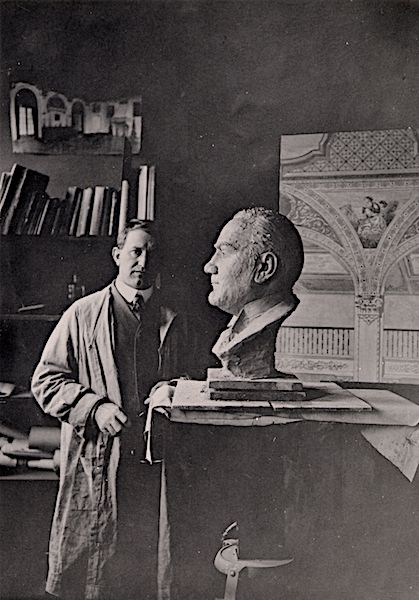

  
  <h2>Painter, Designer, Sculptor</h4>

  
Fausto Tasca is a noteworthy but nearly forgotten artist of early twentieth century California. Academically trained at one of Europe’s finest art schools, Tasca came to the United States as a young adult seeking a broader horizon and carrying not a little ambition in his heart.

  
Self-Portrait with Bust of Caruso, 1922

Although he studied primarily to be a landscape painter and portraitist, Fausto Tasca worked most of his career decorating buildings — banks, libraries, churches, estates. These commissions forced him to compose and execute on a much larger scale than was his taste; and they occasioned more than a few ingenious inventions.

According to his son, Fausto Tasca preferred working in watercolors above all other mediums. Sadly, not one commission for a watercolor painting is known among his work. Fausto Tasca did paint frequently in watercolors, but these works were typically preparatory sketches or concept drawings intended to illuminate his plans for a particular project. Most frequently, these sketches were presented to prospective clients in the hopes of winning a commission.

Although Fausto Tasca died at the relatively young age of 52, he left behind a noteworthy list of clients and commissions. His early ambitions of portrait artist were never completely fulfilled, but his legacy of exceptionally well-crafted paintings and occasional works of singular brilliance make him an artist whose work should find a permanent place in the history of California’s art.
