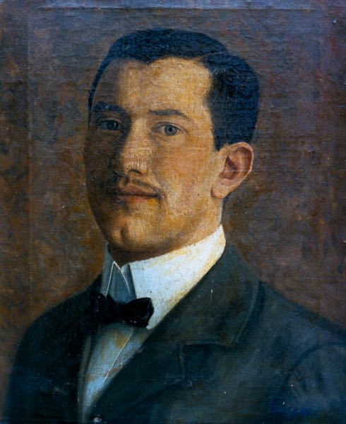

  

#### Painter, Designer, Sculptor

Fausto Bellino Tasca was the first child of Angelo Tasca (1848&#8211;1939) and Luigia Battagin (1857&#8211;1922). He was born in the family home on June 24, 1885 in the northern Italian village of San Zenone degli Ezzelini (Treviso).

Fausto Bellino Tasca Self-Portrait as a Young Man, oil on canvas, 1905

